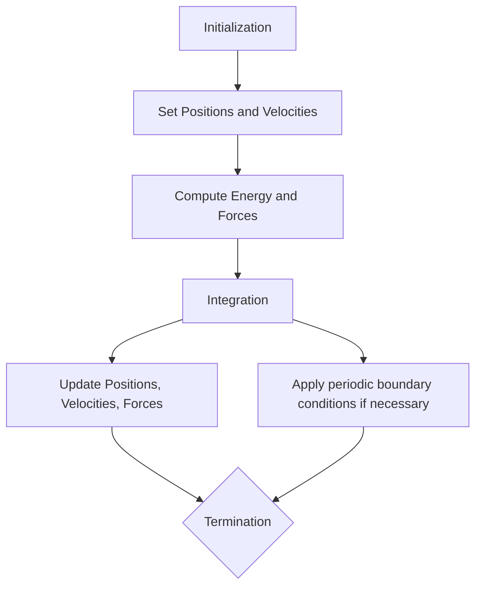

# 1 Simulation under the NVE ensemble

## 1.1 Overview
### 1.1.1 Prehistory of Computer Simulation:
* The Los Alamos MANIAC (Mathematical Analyzer, Numerical Integrator, and Computer) became operational in 1952. This event marks a significant milestone in the history of computing. Nicholas Metropolis, as the most notable early user, developed the Monte Carlo method, a statistical technique that utilizes random sampling to solve complex mathematical problems. 

* The launch of computer also opened the door for the study of many fundamental problems. Most of the material systems consist of many atoms or molecules, how can we infer the properties of such systems? In the past, people had to do it either analytically (e.g., thermodynamics and statistical mechanics have been developed to study some classical systems such as ideal gas, Ising Model, ferromagnetic phase transition and alloys. Some analytic solutions can be derived). They are very intelligent but lack the atomic detail. An alternative approach is directly model the system (straightforward but very time-consuming and tedious). Notable examples include. 
1. [Buffon's needle experiment](https://en.wikipedia.org/wiki/Buffon%27s_needle_problem) to compute $\pi$, 
2. [Bernal's ball-bearing model](https://iopscience.iop.org/article/10.1088/0953-8984/26/46/463102), 
3. [Kitaigorodskii’s structure seeker](https://pubs.acs.org/doi/10.1021/acs.cgd.8b00972).

* Molecular dynamics Simulation is generally a technique to directly study the atomic evolution of atoms or molecules in the material system based on the simple law of Newtonian Dynamics. Immediately after the invention of computers, MD simulations were quickly applied to several systems
1. First ever, 1956, Alder and Wainwright (Livermore), [Phase transition of hard spheres](https://gibbs.ccny.cuny.edu/teaching/s2021/labs/HardDiskSimulation/Alders&Wainwright1957.pdf)
2. Real material, 1959, Gibson, Goland, Milgram, Vineyard (Brookhaven), [Dynamics of radiation damage](https://journals.aps.org/pr/abstract/10.1103/PhysRev.120.1229)
3. Liquid, 1964, Rahman, [Correlations in Liquid Argon](https://journals.aps.org/pr/abstract/10.1103/PhysRev.136.A405)

### 1.1.2 Why do we need such kind of direct simulation method like MD
* Go beyond the experimental capability
* Gain some physical insights

### 1.1.3 Homework: 
1. Read the Alder & Wainwright's 1956 paper [Phase transition of hard spheres](https://gibbs.ccny.cuny.edu/teaching/s2021/labs/HardDiskSimulation/Alders&Wainwright1957.pdf) and understand the [hard sphere potential](https://en.wikipedia.org/wiki/Hard_spheres)
2. Read the [Rahman](https://en.wikipedia.org/wiki/Aneesur_Rahman)'s [1964 paper](https://journals.aps.org/pr/abstract/10.1103/PhysRev.136.A405). We will try to reproduce some results from this work this week. 

## 1.2 A first MD simulation 

### 1.2.1 The workflow



### 1.2.2 Interatomic potential

[Lennard-Jones Potential](https://en.wikipedia.org/wiki/Lennard-Jones_potential) assumes that all particles interact with each other via pairwise interactions (i.e., the interaction energy only depends on the distance).

$$
V(r) = 4\epsilon \left[ \left(\frac{\sigma}{r}\right)^{12} - \left(\frac{\sigma}{r}\right)^{6} \right]
$$

It consist of two components:
* $1/r^{12}$ term to account for short range repulsion
* $-1/r^6$ term to account for the long range attraction (also called [London dispersion force](https://en.wikipedia.org/wiki/London_dispersion_force))
* ε and σ control the equilibrum distance and shape of the energy well. 

This form has been widely used to model the essential features of interactions between simple atoms and molecules.

#### Questions:
1. Why were the 12 and 6-powered terms were chosen? Any other choices?
2. How does the LJ potential decay with respect to r?
3. The limitations of LJ potential?
4. Can we use them to model metal, ceramics or others?

### 1.2.3 The computation of energy and forces

After knowing the energy model, we can proceed to compute the total energy and forces for each particle in the given system. Assuming the system consists of $N$ atoms, and the positions ($R$) are recorded by an array of [N, 3], we can use the following pseudocode to compute the energy and forces:

```python
def compute_energy_forces(positions, epsilon, sigma):
    N = len(positions)
    energy = 0.0
    forces = np.zeros_like(positions)
    
    for i in range(N):
        for j in range(i + 1, N):
            r_ij = positions[j] - positions[i]
            r = np.linalg.norm(r_ij)
            r6 = (sigma / r) ** 6
            r12 = r6 ** 2
            
            # Lennard-Jones potential
            e_ij = 4 * epsilon * (r12 - r6)
            energy += e_ij
            
            # Force calculation
            f_ij = 24 * epsilon * (2 * r12 - r6) / r**2 * r_ij
            forces[i] += f_ij
            forces[j] -= f_ij
    
    return energy, forces
```

### 1.2.4 Notes: Derivation of Forces
The force $\mathbf{F}(r)$ between two particles is the negative gradient of the potential:

$$
\mathbf{F}(r) = -\frac{dV(r)}{dr}
$$

Taking the derivative of the potential with respect to $r$:

$$
\begin{align*}
\frac{dV(r)}{dr} &= 4\epsilon \left[ -12\left(\frac{\sigma}{r}\right)^{12} \frac{1}{r} + 6\left(\frac{\sigma}{r}\right)^{6} \frac{1}{r} \right]\\
                 &= \epsilon \left[ \frac{48\sigma^{12}}{r^{13}} - \frac{24\sigma^{6}}{r^{7}} \right]
\end{align*}
$$

Thus, the force $\mathbf{F}(r)$ is:

$$
\mathbf{F}(r) = -\frac{dV(r)}{dr} = -\epsilon \left[ \frac{48\sigma^{12}}{r^{13}} - \frac{24\sigma^{6}}{r^{7}} \right]
$$

### 1.2.5 Initialization
* Atomic positions
If we study a system that mimics solid, we can just create the position on a lattice compatible with the structure that we aim to simulate. You must avoid the case of geometry consisting of two atoms with very short distances.

* Velocities
Ideally, we should generate the initial velocities to follow the [Maxwell-Boltzmann distribution](https://en.wikipedia.org/wiki/Maxwell–Boltzmann_distribution).

$$
p(v) = 4\pi \left( \frac{m}{2\pi k_B T} \right)^{3/2} v^2 \exp\left(-\frac{mv^2}{2k_B T}\right)
$$

To achieve this, the idea is to sample velocities from a normal (Gaussian) distribution, where the standard deviation is related to the temperature and the mass of the particles.

```python
import numpy as np

def generate_velocities(num_particles, temperature, mass):
    # Boltzmann constant in appropriate units (e.g., J/K or eV/K)
    k_B = 1.380649e-23  # J/K

    # Standard deviation of the velocity distribution
    sigma_v = np.sqrt(k_B * temperature / mass)

    # Generate velocities from a normal distribution
    velocities = np.random.normal(0, sigma_v, (num_particles, 3))

    return velocities

# Example usage
num_particles = 1000       # Number of particles
temperature = 300          # Temperature in Kelvin
mass = 1.67e-27            # Mass of a particle in kg (e.g., proton)

velocities = generate_velocities(num_particles, temperature, mass)

# Subtract the mean velocity to ensure zero net momentum
mean_velocity = np.mean(velocities, axis=0)
velocities -= mean_velocity

print("Velocities adjusted for zero total momentum (m/s):")
print(velocities[:5])
```
<!---In addition the above script, one can also use [scipy.stats.maxwell](https://docs.scipy.org/doc/scipy/reference/generated/scipy.stats.maxwell.html#scipy.stats.maxwell) to generate random samples.

Note, for the current task of NVE simulation, we would compute velocity from $\mathbf{r}(t)$ trajectory. Therefore, this setup would only impact the first step of integration. If the simulation converges, it won't have impacts on the simulation.
--->

### 1.2.6 Integrator (updating rule)
After initialization, we need to apply periodic boundary conditions if necessary. This ensures that particles leaving one side of the simulation box re-enter from the opposite side, maintaining a constant number of particles.

$$
\begin{align*}
\mathbf{r}(t+dt) &= \mathbf{r}(t) + \mathbf{v}(t)dt\\
\mathbf{v}(t+dt) &= \mathbf{v}(t) + \mathbf{a}(t)dt
\end{align*}
$$

However, this update will suffer from a rapid propagation of error. To reduce the error propogation, we use the so called [Velocity Verlet algorithm](https://en.wikipedia.org/wiki/Verlet_integration). 

$$
\begin{align*}
\mathbf{r}(t + dt) &= \mathbf{r}(t) + \mathbf{v}(t)dt + 0.5 \mathbf{a}(t) dt^2  \\
\mathbf{v}(t + dt) &= \mathbf{v}(t) + 0.5 [\mathbf{a}(t) + \mathbf{a}(t+dt)]dt
\end{align*}
$$

According to Taylor expansion, this algorithm is accurate to $O(dt^3)$ in position and $O(dt^2)$ in velocity. 

## 1.3 Code Implementation and Testing

1. Run [lec_01_maxwell.py](https://github.com/qzhu2017/AtomisticSimulation/blob/main/Codes/lec_01_maxwell.py) to understand the generation of random velocities,
2. Run [lec_02_LJ.py](https://github.com/qzhu2017/AtomisticSimulation/blob/main/Codes/lec_01_LJ.py) to understand how to implement LJ potential to compute energy and forces,
3. Complete the codes in [Colab](https://colab.research.google.com/drive/1lB3R0N_s2gP-IhjrxBWq2mDW2VlqIE_c#scrollTo=KDtmzZIA2kvp),
4. Debug [lec_01_nve_debug.py](https://github.com/qzhu2017/AtomisticSimulation/blob/main/Codes/lec_01_nve_debug.py). You should get a constant `E_total` outputs as shown below if the code works.

   
```
Step      0, PE: -9.74960e-18 KE: 1.60642e-18 E_total: -8.14319e-18 CPU_time: 7.93e-02
Step     10, PE: -9.52152e-18 KE: 1.37792e-18 E_total: -8.14359e-18 CPU_time: 8.52e-01
Step     20, PE: -8.88977e-18 KE: 7.47063e-19 E_total: -8.14271e-18 CPU_time: 1.62e+00
Step     30, PE: -8.86056e-18 KE: 7.17322e-19 E_total: -8.14323e-18 CPU_time: 2.39e+00
```

## 1.4 Summary

In this lecture, we covered the basics of molecular dynamics simulations under the NVE ensemble. We discussed the historical context, the fundamental principles, and the practical implementation steps, including initialization, force computation, integration of equations of motion, and analysis of results. By understanding these concepts, you will be able to simulate and analyze the behavior of atomic systems, gaining insights that are difficult to obtain through experimental methods alone.

Hopefully, you are able to write basic code for MD simulation after this practice. You are expected to reinforce your understanding by writing your own code. 

Of course, there are many excellent open-source MD codes with more functional support. For a productive research project, you would probably use those codes. In this course, we recommend the use of [LAMMPS](https://github.com/lammps/lammps), one of the most popular codes for materials modeling.

For students who already have LAMMPS experience, there is a bonus credit opportunity. Please rerun the simulation in LAMMPS with the same parameter setup and post your LAMMPS script to [our forum](https://github.com/qzhu2017/AtomisticSimulation/issues/1).


