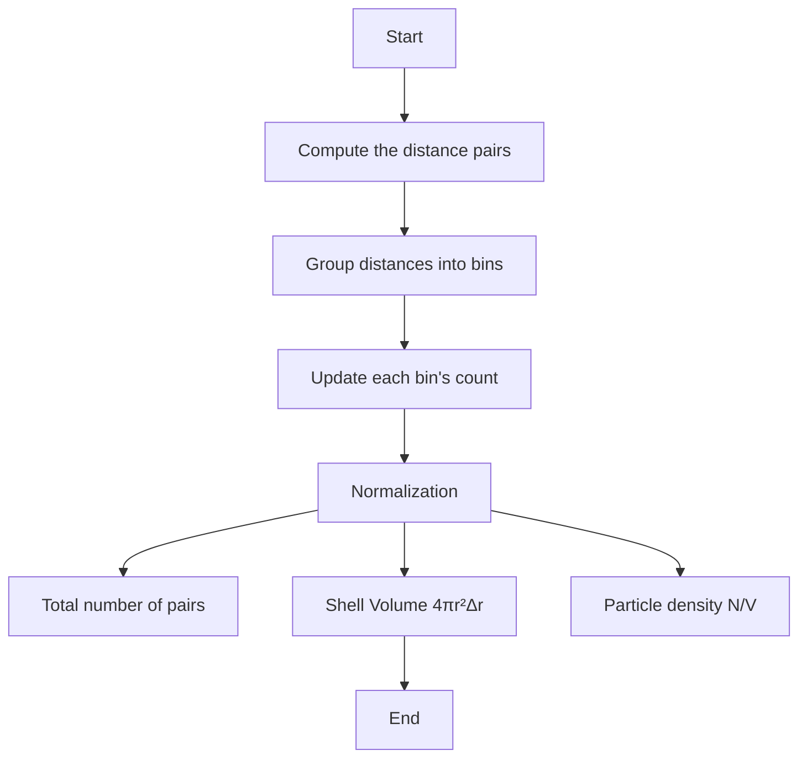

# 5 MD Analysis I: Structural Characterization

So far, we have learned some fundamentals about how to write a code and run a MD simulation to model the atomistic process of materials. By running the simulation, we expect to generate a set of time-dependent atomic trajectories by solving Newton’s equations of motion for a system of particles. Next, it is important to understand these simulation results. Indeed, it is essential to extract meaningful physical properties from the simulation results. In this lecture, we will cover several fundamental post-analysis techniques: 

1. Validation of MD simulation by tracking the evolution of observables,
2. Visualization of MD trajectories,
3. Radial distribution function,
4. Vibrational spectrum.

## 5.1 Evolution of Macroscopic Observables

In the previous lecture and coding exercises, we have frequently mentioned the tracking of observables like total energy, volume, and temperature throughout an MD simulation to ensure the system reaches equilibrium and conserves energy (in appropriate ensembles).

1. NVE: Total energy should remain constant.
2. NVT: A fluctuation of Temperature or kinetic energy around some values).
3. NPT: Both Temperature and Volume fluctuate to maintain temperature and pressure.

In your MD simulation, it is advised to save these values every some time interval. Many codes would print out these information to some file. You must go over these results to ensure your simulation results make sense!

```python
import numpy as np
import matplotlib.pyplot as plt

# Load MD data (time, energy, volume, temperature)
time = np.loadtxt('time.dat')  # Time data
energy = np.loadtxt('energy.dat')  # Total energy
volume = np.loadtxt('volume.dat')  # System volume
temperature = np.loadtxt('temperature.dat')  # Temperature

# Plot evolution of observables
plt.figure(figsize=(12, 6))
plt.subplot(3, 1, 1)
plt.plot(time, energy, label='Total Energy', color='b')
plt.xlabel('Time (ps)')
plt.ylabel('Energy (eV)')
plt.title('Evolution of Total Energy')

plt.subplot(3, 1, 2)
plt.plot(time, volume, label='Volume', color='g')
plt.xlabel('Time (ps)')
plt.ylabel('Volume (ų)')
plt.title('Evolution of Volume')

plt.subplot(3, 1, 3)
plt.plot(time, temperature, label='Temperature', color='r')
plt.xlabel('Time (ps)')
plt.ylabel('Temperature (K)')
plt.title('Evolution of Temperature')
```

## 5.2 MD Trajectory Visualization
Visualization allows researchers to visually inspect the dynamics of the system, spot abnormalities, and better understand atomic movements. Tools like [OVITO](https://www.ovito.org) are commonly used. Please refer to [OVITO](https://www.ovito.org) pape to find more functions.

## 5.3 Radial Distribution Function (RDF)
The [Radial Distribution Function ](https://en.wikipedia.org/wiki/Radial_distribution_function) $g(r)$ measures the probability of finding a particle at a distance $r$ from a reference particle.

$$
g(r) = \frac{V}{N^2} \left\langle \sum_{i=1}^{N} \sum_{j \neq i}^{N} \delta(r - r_{ij}) \right\rangle \cdot \frac{1}{4 \pi r^2 \Delta r}
$$

Where:

- $V$  is the volume of the system.
- $N$  is the number of particles.
- $r_{ij}$  is the distance between particles $i$ and $j$ .
- $\delta(r - r_{ij})$ is the Dirac delta function ensuring that only pairs with separation $r_{ij}$ equal to $r$ contribute.
- $4\pi r^2 \Delta r$ is the volume of a spherical shell at distance $r$ with thickness $\Delta r$.

<p align="center">
  
  
</p>



```Python
def compute_rdf(positions, num_bins=100, r_max=10.0):
    N = len(positions)  # Number of atoms
    rdf = np.zeros(num_bins)
    dr = r_max / num_bins
    for i in range(N):
        for j in range(i+1, N):
            r = np.linalg.norm(positions[i] - positions[j])
            if r < r_max:
                bin_index = int(r / dr)
                rdf[bin_index] += 2  # Each pair counted twice

    # Normalize RDF
    r = np.linspace(0, r_max, num_bins)
    rdf /= (4 * np.pi * r**2 * dr * N)
    return r, rdf

# Example usage
positions = np.random.rand(100, 3) * 10  # Generate random positions
r, g_r = compute_rdf(positions)

# Plot RDF
plt.plot(r, g_r)
plt.xlabel('r (Angstrom)')
plt.ylabel('g(r)')
plt.title('Radial Distribution Function')
plt.show()
```

RDF is commonly used to characterize the short-range order in liquids and gases. In a RDF, we are interested the location of Peaks and their spreads, as they indicate common interatomic distances (e.g., 1st and 2nd nearest-neighbor distance).

## 5.4 Vibration Spectrum
In addition to RDF, another commond characterization is to understand how particles in a system vibrate. In experiment, such information can be measured from Infrared (IR) or Raman Spectroscopy, and Inelastic Neutron/X-ray Scattering. An analogical measurement in MD is the **Vibrational Density of States** (VDOS). 

In a MD simulation, the VDOS, called $D(\omega)$ is essentially the frequency spectrum of atomic vibrations in the system. The VDOS is closely related to the **Velocity Autocorrelation Function** (VACF). The VDOS provides information about the frequencies at which particles in a system vibrate, while the VACF gives insight into how the velocity of a particle at one time is correlated with its velocity at a later time. It is computed by taking the Fourier transform of the VACF. This relationship is derived from the fact that oscillatory motions (vibrations) in the system are directly reflected in the velocity autocorrelation function, and the Fourier transform allows us to extract the frequency components of these vibrations.

Mathematically, the relationship is:

$$
D(\omega) = \frac{1}{2\pi} \int_{-\infty}^{\infty} C(\tau) e^{-i\omega\tau}  d\tau
$$

Where:

- $C(\tau)$ is the velocity autocorrelation function.
- $\omega$ is the angular frequency.
- $\tau$ is the time lag.

The Fourier transform is performed over the time correlation $\tau$ to convert the time-domain information in the VACF into frequency-domain information in the VDOS.

The **VACF**, called $C(\tau)$, measures how the velocity of a particle at a given time $t$ correlates with its velocity at some later time $t + \tau$. It is useful for understanding particle dynamics and is related to the vibrational properties and transport coefficients (like diffusion).

$$
C(\tau) = \frac{1}{N} \sum_{i=1}^{N} \left\langle \mathbf{v}_i(0) \cdot \mathbf{v}_i(\tau) \right\rangle
$$

- $N$ is the total number of time steps in the simulation.
- $\mathbf{v}_i(t)$ is the velocity of particle $i$ at time step $t$.

In practice, because simulations are finite and VACF data is computed over a limited time interval, we typically use the discrete Fourier transform (DFT) or fast Fourier transform (FFT) to compute the VDOS numerically:

$$
D(\omega) = \frac{1}{2\pi} \int_0^{\infty} C(\tau) \cos(\omega \tau) d\tau
$$


```python
from scipy.fft import fft

def compute_vacf(velocities):
    vacf = np.correlate(velocities, velocities, mode='full')
    return vacf[vacf.size // 2:]  # Only take positive lag times

# Example: Simulate random velocities
velocities = np.random.randn(1000)

# Compute VACF
vacf = compute_vacf(velocities)

# Compute vibration spectrum via Fourier Transform
vibration_spectrum = np.abs(fft(vacf))

# Plot vibration spectrum
plt.plot(vibration_spectrum[:len(vibration_spectrum)//2])
plt.xlabel('Frequency (THz)')
plt.ylabel('Intensity')
plt.title('Vibration Spectrum')
plt.show()
```

## 5.5 Why is VACF related to VDOS? 

### 5.5.1 Normal modes
In a system of $N$ atoms, each atom has 3 degrees of freedom (one for each Cartesian coordinate: $x$, $y$, and $z$). Therefore, the total number of degrees of freedom is $3N$. To understand the pattern of the collective vibrations, we can decompose it into a sum of normal modes, each vibrating at a distinct frequency. And each **normal mode** corresponds to one of these degrees of freedom in terms of collective motion. And each normal mode in a system is orthogonal to the others. 

In experiment, you can measure the vibration using IR, Raman or Neutron scattering. How can we measure the vibration from MD trajectory? The key is to extract the viration frequencies from each normal mode.

### 5.5.2 Vibration Frequency of a single harmonic oscillator
Let's imagine a simplest case of a single harmonic oscillator, the velocity of an atom is related to its position by:

$$
v(t) = \frac{d}{dt} r(t)
$$

For sinusoidal motion  $r(t) = A \cos(\omega t + \phi)$ , where  $A$  is the amplitude, the velocity becomes:

$$
v(t) = -A \omega \sin(\omega t + \phi)
$$

This shows that the velocity oscillates at the same frequency $\omega$ as the position but is phase-shifted. Since the velocities are derived from the same harmonic motion, the VACF (which tracks velocity correlations over time) encodes the vibrational frequencies of the system.

The **power spectrum** is given by the Fourier transform of the VACF:

$$
S(\omega) = \int_{-\infty}^{\infty} C_v(t) e^{-i \omega t} dt
$$

$S(\omega)$ reveals the frequencies at which the velocities oscillate. For a system of harmonic oscillators, these frequencies correspond directly to the vibrational frequencies of the system because atomic vibrations drive the velocity behavior. Hence $S(\omega)$ captures the strength of the velocity fluctuations at each frequency $\omega$. 

Since these frequencies arise from the harmonic vibrations of atoms, the power spectrum $S(\omega)$ gives us direct insight into the vibrational modes of the system. Hence $S(\omega)$ should be proportional to the VDOS $D(\omega)$ because both describe the distribution of vibrational frequencies in the system. In the harmonic approximation:

- $D(\omega)$ counts the number of vibrational modes at frequency $\omega$,
- $S(\omega)$ measures the velocity oscillations caused by these vibrational modes.

To express this mathematically, we use the relation:

$$
D(\omega) \propto S(\omega)
$$

This says that the VDOS is proportional to the power spectrum of the VACF. To get the VDOS from the power spectrum, we can normalize it so that:

$$
D(\omega) = A \int_{-\infty}^{\infty} C_v(t) e^{-i\omega t} dt
$$

where $A$ is a normalization constant.

Since $C_v(t)$ is a real and even function (i.e., $C_v(t) = C_v(-t)$ ), we can simplify the integral by considering only the positive time part and using the cosine transform instead of the full complex Fourier transform. This gives:

$$
D(\omega) = A \int_{0}^{\infty} C_v(t) \cos(\omega t) dt
$$

This form shows that the VDOS is directly obtained by taking the cosine transform of the VACF, which captures the oscillatory nature of the velocity correlations and connects them to the vibrational frequencies in the system.

### 5.5.3 Vibration Frequencies of many harmonic oscillators
If the system has only one normal mode, we can trivially found the frequency by computing the $S(\omega)$. What if the system consists of two normal modes? The $S(\omega)$ would carry the information for both modes. Remember that each normal mode in a system is **orthogonal** to the others. Each mode will make its own contribution to $S(\omega)$. If these modes are identical, you will see a peak with the doubled magnitude. If these modes are different, you will a two distant peaks. Therefore, you just need to compute the total VACF once and then compute $S(\omega)$ from its Fourier Transform. 

### 5.5.4 Computational Experiment 
To understand the concept of VACF, we can perform a simple numerical experiment to simulate two model systems based on an O$_2$ diatomic molecule. In a O$_2$, the equilibrium distance is we consider the atoms are connected by a spring with $k$=1180 N/m. 
In the first model, we seek to simulate a simple vibration harmonic, by creating the initial velocities along the spring. In the second model, we simulate the combination of vibration and rotation by creating the initial velocites not aligned on the spring. 

   

Running the following MD code, you expect to simulate the motions and then compute the corresponding VACF and VDOS.
```python
import numpy as np
import matplotlib.pyplot as plt
from scipy.fftpack import fft

def harmonic_force(r1, r2, k, r_eq):
    # Function to compute force due to harmonic potential
    r12 = np.linalg.norm(r2 - r1)
    force_mag = -k * (r12 - r_eq)
    force = -force_mag * (r2 - r1) / r12
    return force

def MD(r1, r2, v1, v2, N_steps):
    velocities = np.zeros([N_steps, 6])
    F12 = harmonic_force(r1, r2, k, r_eq)

    for step in range(N_steps):
        # Verlet update
        r1 += v1 * dt + 0.5 * F12 / mass * dt ** 2
        r2 += v2 * dt - 0.5 * F12 / mass * dt ** 2

        F12_new = harmonic_force(r1, r2, k, r_eq)

        v1 += 0.5 * (F12 + F12_new) * dt / mass
        v2 -= 0.5 * (F12 + F12_new) * dt / mass

        F12 = F12_new
        velocities[step][:3] = v1
        velocities[step][3:6] = v2
    return velocities

if __name__ == "__main__":

    # Parameters for the simulation
    dt = 1e-15
    data = [
            ('O$_2$ (vibration)', 1.16, 1180, 2.66e-26, 2000, False),
            ('O$_2$ (vibration + rotation)', 1.16, 1180, 2.66e-26, 5000, True),
            #('H2', 0.74,  510, 1.67e-27),
            #('N2', 1.10, 2294, 2.33e-26)
           ]
    fig, axs = plt.subplots(2, len(data), figsize=(12, 6))

    for i, (name, r, k, mass, N_steps, rotate) in enumerate(data):
        print(name, r, k, mass)
        r_eq = r * 1e-10        # equlibrium distance in m

        # Initial positions
        r1 = np.array([0.0, 0.0, 0.0])
        r2 = np.array([0.0, 0.0, r_eq*1.2])

        # Initialize velocities
        v1 = np.zeros(3)
        v2 = np.zeros(3)
        if rotate:
            v1[0] += 50
            v2[0] -= 50

        # MD simulation
        velocities = MD(r1, r2, v1, v2, N_steps)

        # Plot VACF
        VACF = np.array([np.dot(velocities[0], velocities[t]) for t in range(N_steps)])
        axs[0, i].plot(np.arange(N_steps)*dt*1e12, VACF)
        axs[0, i].set_title(name)
        axs[0, i].set_xlabel('Time (ps)')
        axs[0, i].set_ylabel('VACF')

        # Plot VDOS
        VDOS = np.abs(fft(VACF))**2
        freqs = np.fft.fftfreq(N_steps, dt) / 1e12
        axs[1, i].plot(freqs[:N_steps//2], VDOS[:N_steps//2])
        axs[1, i].set_xlabel('Frequency (THz)')
        axs[1, i].set_ylabel('log-VDOS')
        axs[1, i].set_xlim([0, 60])
        axs[1, i].set_yscale('log')
    plt.tight_layout()
    plt.show()
```
   

For the ideal harmonic oscillators, you should expect that the VACF remain the same behavior overtime. Thanks to Fourier analysis, we can conveniently extract the vibrational frequencies for a single and mutiple harmonic oscillators. However, some numerical aspects must be noted. For instance, the low-frequency modes cannot be sampled efficiently within a short VACF run time. The magnitude needs to be properly rescaled if needed.

Here is a report regarding the simulation of most realistic system [VDOS study of LJ liquid and solids](https://aiichironakano.github.io/phys516/VAC.pdf).


## 5.6 Further discussions

For the realistic system, LAMMPS allows the computation of both RDF and VACF. Therefore, one just needs to directly get them from the lammps output and then plot them on your own.

- **Interpretation of RDF**: Peaks in RDF tells the atomic neighbor counts. Liquid and solid have very different behaviors in their RDF.  
- **Interpretation of VDOS**: Peaks in the VDOS correspond to characteristic vibrational modes of the system. Try to identify the Low-frequency and high-frequency modes and link them to atomic motions from MD trajectory.
- **Practical issues in computing VDOS**. Assuming there exist a very small frequency, how can you ensure that such a vibraion mode can be relected in your VACF?
