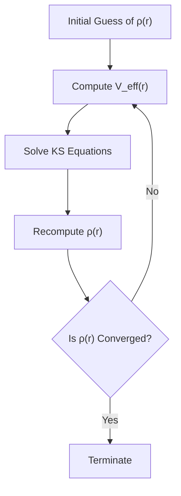

# 9 Introduction to Density Functional Theory

## 9.1 Schrödinger Equation 

In 1920-1930, Schrödinger proposed the famous equation to calculate the wavefunction $\Psi$ of a quantum system, encapsulating all its physical properties.
The time-independent Schrödinger equation for a system of $N$ interacting electrons is:

$$
\hat{H} \Psi(\mathbf{r}_1, \mathbf{r}_2, \cdots, \mathbf{r}_N) = E \Psi(\mathbf{r}_1, \mathbf{r}_2, \cdots, \mathbf{r}_N)
$$

- $\hat{H}$ is the Hamiltonian operator, including kinetic and potential energies.
- $\Psi$ is the many-electron wavefunction, depending on the positions of all electrons.
- $E$ is the total energy of the system.

The Hamiltonian for such a system is:

$$
\hat{H} = \sum_{i=1}^{N} \left( -\frac{\hbar^2}{2m} \nabla_i^2 + V_{\text{external}}(\mathbf{r}_i) \right) + \sum^{i \lt j} \frac{e^2}{4\pi\epsilon_0 |\mathbf{r}_i - \mathbf{r}_j|}
$$

where 

- The first term represents the kinetic energy of each electron (often denoted as $\hat{T}$)
- $V_{\text{external}}$ represents the external potential.
- The second summation accounts for electron-electron Coulomb interactions.

## 9.2 Numerical Solution of single electron Schrödinger equation
Let's first review how to obtain a numerical solution to the most simple case, i.e., a single electron under a given external potential, i.e., 

$$
\left( -\frac{\hbar^2}{2m} \nabla^2 + V_{\text{external}}(\mathbf{r}) \right) \Psi(\mathbf{r}) = E \Psi(\mathbf{r})
$$

A typical solution involves the following steps:
1. **Define the discete grids** to describe the wavefunction spanning.
2. **Define the external potential** ($V_\textrm{external}$) on the given spatial grids.
3. **Build up the Hamiltonian matrix** ($H$) on the given spatial grids based on the $V_\textrm{external}$ and kinetic energy operator.
4. **Solve the eigenvalue and eigenvectors** for the given $H$

### 9.2.1 Kinetic Energy Operator

The kinetic energy operator ($\hat{T}$) for an electron in one dimension is given by the Laplacian operator, which is the second derivative of the wavefunction with respect to position. The corresponding term in the Hamiltonian is:

$$
\hat{T} = -\frac{\hbar^2}{2m} \frac{d^2}{dx^2}
$$

To solve this equation numerically, we approximate the second derivative using the finite difference method. Consider a function $f(x)$ on a discrete grid of points $x_1, x_2, …, x_N$ with spacing $dx$. The second derivative of the function $f$  at point $x_i$ can be approximated by the finite difference formula:

$$
\frac{d^2 f}{dx^2} \bigg|{x_i} \approx \frac{f(x_{i+1}) - 2f(x_i) + f(x_{i-1})}{dx^2}
$$

The expression tells us how to approximate the curvature of the function at each point using values of the function at neighboring points.

To apply this approximation to a system with $N$ discrete points, we can represent it using a matrix that operates on the values of the function at all grid points. The matrix will essentially encode the coefficients ``(-2, +1, +1)`` that multiply the values $f(x_i), f(x_{i-1}), f(x_{i+1})$.

- ``np.eye(N)``: an identity matrix of $N \times N$.
- ``np.eye(N, k=1)}``: a matrix of $N \times N$ with ones on the first upper diagonal.
- ``np.eye(N, k=-1)`` : a matrix of $N \times N$  with ones on the first lower diagonal.

Thus, the combination of these matrices gives us a matrix representation of the finite difference approximation of the second derivative operator across the entire grid. The division by $dx^2$ normalizes the matrix to account for the grid spacing.

For a 5-point grid, the matrix $T$ would look something like this:

$$
T = \frac{1}{dx^2}
\begin{bmatrix}
-2 & 1  & 0  & 0  & 0  \\
1  & -2 & 1  & 0  & 0  \\
0  & 1  & -2 & 1  & 0  \\
0  & 0  & 1  & -2 & 1  \\
0  & 0  & 0  & 1  & -2 \\
\end{bmatrix}
$$

This matrix will act on a vector representing the function $f$ at discrete grid points to approximate the second derivative for the entire grid. It physically represents the kinetic energy operator in one dimension (ignoring constants like $\hbar^2/2m$ ). When this matrix acts on the wavefunction, it computes the kinetic energy for the system in a discretized space.
Extensions

### 9.2.2 The solution of 1D system
If we limit ourselves to a 1D space, the follow code gives an example to obtain the numerical solution. One can try to adjust the $V_{\text{external}}$ to mimic any arbitrary potentials. 

```python
# Spatial grid parameters
x_min, x_max = -10.0, 10.0
N = 1000  # Number of grid points
x = np.linspace(x_min, x_max, N)
dx = x[1] - x[0]

# Definite the external potential
V_ext = 0.5 * x**2                   # a harmonic oscillator 
#V_ext = -1 / np.sqrt((x**2+0.5))    # eletric field under a positive charge

# Define the kinetic energy operator
T = -0.5 * (-2 * np.eye(N) + np.eye(N, k=1) + np.eye(N, k=-1)) / dx**2

# Total Hamiltonian
H = T + np.diag(V_ext)

# Solve eigenvalue problem
energies, wavefunctions = np.linalg.eigh(H)

# Get electron density
psi = wavefunctions[:, 0]
psi /= np.sqrt(np.sum(np.abs(psi)**2) * dx)
rho = np.abs(psi)**2

# Print the energies
T_s = np.sum(psi * T.dot(psi)) * dx
E_ext = np.sum(rho * V_ext) * dx

print(f"Kinetic Energy  (T)       = {T_s:.6f} Hartree")
print(f"External Energy (E_ext)   = {E_ext:.6f} Hartree")
print(f"Total Energy    (E_total) = {energies[0]:.6f} Hartree")
```

After the results are obtained, one can also visualize the wavefunction or electron density for its ground states or excited states.

```python
# Plot the effective potential
fig, axs = plt.subplots(1, 2, figsize=(12, 4))

axs[0].plot(x, V_ext, label='$V_{ext}$', linestyle='--')
axs[0].set_xlabel('Position $x$')
axs[0].set_ylabel('Potential')
for i in range(3):
    axs[0].axhline(energies[i])
axs[0].legend()

# Plot the electron density
for i in range(3):
    rho = np.abs(wavefunctions[:, i])**2  # Ground state
    rho /= (rho.sum() * dx)
    axs[1].plot(x, rho, label=f'E{i}={energies[i]:.1f} Ha')
axs[1].plot(x, rho)
axs[1].set_xlabel('Position $x$')
axs[1].set_ylabel('Density')
axs[1].legend()

plt.tight_layout()
plt.show()
```

### 9.2.3 The solution of 3D system
For a more practical application, we often deal with the electrons at a 3D space, below is a script that solves the single hydrogen atom system.

```python
import numpy as np
from scipy.sparse import kron, eye
from scipy.sparse import diags, csr_matrix
from scipy.sparse.linalg import eigsh  # Sparse eigenvalue solver for faster performance
import matplotlib.pyplot as plt

# Define 3D grid parameters
N = 60  # Grid size along each dimension
L = 10  # Simulation box size in Bohr
dx = L / N
x = np.linspace(-L/2, L/2, N)
y = np.linspace(-L/2, L/2, N)
z = np.linspace(-L/2, L/2, N)
X, Y, Z = np.meshgrid(x, y, z, indexing="ij")

# Define the external potential to mimic the hydrogen proton
num_electrons = 1.0
R1 = np.array([0, 0, 0])
softening = 0.02  # To prevent singularity at nuclei
scaling_factor = 1.0  # Scale down the external potential
V_ext = scaling_factor * (-1 / np.sqrt((X - R1[0])**2 + (Y - R1[1])**2 + (Z - R1[2])**2 + softening**2))

def kinetic_energy_operator(N, dx):
    # Define 1D kinetic energy finite difference operator
    main_diag = -2 * np.ones(N)
    side_diag = np.ones(N - 1)
    T_1D = diags([main_diag, side_diag, side_diag], [0, -1, 1], shape=(N, N)) / dx**2

    # Build 3D kinetic energy operator using Kronecker products
    I = eye(N, format='csr')  # Identity matrix for each dimension
    T = kron(kron(T_1D, I), I) + kron(kron(I, T_1D), I) + kron(kron(I, I), T_1D)

    return -0.5 * T  # Scale by -0.5 for the kinetic energy operator

# Kinetic energy operator (sparse)
T = kinetic_energy_operator(N, dx)
V_ext_flat = V_ext.flatten()
H = T + diags(V_ext_flat, 0, shape=(N**3, N**3))

# Solve the single-electron equation with a faster solver
energies, orbitals = eigsh(H, k=5, which='SA')
print("Energies from the solver", energies)

# Normalize wavefunction to ensure it represents one electron
psi = orbitals[:, 0].reshape((N, N, N))  # Ground state orbital
psi /= np.sqrt(np.sum(np.abs(psi)**2) * dx**3)
rho = np.abs(psi)**2  # Electron density

# Compute energies 
T_s = np.sum(psi.flatten() * T.dot(psi.flatten())) * dx**3  # Kinetic energy with psi
E_ext = np.sum(rho * V_ext) * dx**3

print(f"Kinetic Energy  (T)      = {T_s:.6f} Hartree")
print(f"External Energy (E_ext). = {E_ext:.6f} Hartree")
print(f"Total Energy    (E_total)= {T_s + E_ext:.6f} Hartree\n")


# plot electron density for the first few solutions
for i in range(5):
    psi = orbitals[:, i].reshape((N, N, N))
    psi /= np.sqrt(np.sum(np.abs(psi)**2) * dx**3)

    rho = np.abs(psi)**2
    rho1 = rho[N//2, :, :]
    print(i, np.sum(rho)*dx**3, np.sum(rho1)*dx**3, rho.max())
    plt.imshow(rho1,
               origin='lower',
               vmin=1e-5,
               vmax=5e-3)
    plt.xlabel('x (Bohr)')
    plt.ylabel('y (Bohr)')
    plt.title(f'Single H atom in level {i}: {energies[i]:.2f} Ha')
    plt.colorbar(label='Electron Density')
    plt.show()
```

Note that in the above codes, we also compute the kinetic and external energy to double check if the implemented code works properly.

$$
T = -\frac{1}{2} \int \psi^*(\mathbf{r}) \nabla^2 \psi(\mathbf{r})  d^3\mathbf{r} 
$$

$$
E_{\text{external}} = \int \rho(\mathbf{r}) V_{\text{ext}}(\mathbf{r}) \, d^3\mathbf{r}
$$

The numerical expressions are

$$
T \approx -\frac{1}{2} \sum_i \psi_i^* \left( \nabla^2 \psi \right)_i  dx^3
$$

$$
E_{\text{external}} \approx \sum_i \rho_i V_{\text{external}, i} \, dx^3
$$

To check if your implmentation is correct, one should compare the results with the analytical solutions for a single H atom. The energy levels for a hydrogen atom in Hartree units (where 1 Hartree = 27.2 eV) are given by the formula:

$$
E_n = -\frac{1} {n^2}\text{ Hartree}
$$

At the ground state, the system has $T$=0.5 Hartree, and $E_{\text{external}}$ = 1.0 Hartree. 

Additionally, one should plot the first few atomic orbitals (e.g., 1s, 2s, 2px, 2py, 2pz) to verify the code implementation.


## 9.3 The Challenge of Many-Electrons Equation

While it is straightforward to deal with single electron equation, solving the Schrödinger equation for systems with more than one electron becomes intractable due to the electron-electron interactions. Hartree and Hartree-Fock Methods were developed to apply the mean-field approximations to simplify the many-body problem but still faced limitations, particularly in accounting for electron correlation. 

It is not easy to solve this equation due to the following issues,
- The wavefunction $\Psi$ depends on $3N$ spatial coordinates, making it computationally infeasible for large $N$.
- Computational resources required grow exponentially with the number of electrons.
- Properly accounting for interactions and correlations between electrons is challenging.
- Methods like Hartree-Fock simplify the problem but neglect electron correlation, leading to inaccuracies.
  

## 9.4 Density Function Theory

Thanks to Walter Kohn and many other pioneers, Density Functional Theory (DFT) has become an indispensable tool in physics, chemistry, and materials science for studying the electronic structure of matter. We will examine some basics in this section.

### 9.3.1 Kohn and Hohenberg Theorems
In 1964, Pierre Hohenberg and Walter Kohn established Density Functional Theory (DFT) that the ground-state properties of a many-electron system are uniquely determined by its electron density $\rho(\mathbf{r})$.

1. The ground-state electron density $\rho_0(\mathbf{r})$ uniquely determines the external potential $V_{\text{external}}(\mathbf{r})$, up to a constant, and hence all properties of the system. 

2. There exists a universal functional $E[\rho]$ such that the ground-state energy $E_0$ can be obtained variationally:

$$
E_0 = \min_{\rho} \left[ E[\rho] = F[\rho] + \int V_{\text{external}}(\mathbf{r}) \rho(\mathbf{r}) d\mathbf{r} \right]
$$

where $F[\rho]$ is a universal functional comprising the kinetic energy and electron-electron interactions.

From these two theorems, we can find that
- All observables are functionals of the electron density $\rho(\mathbf{r})$.
- One can reduce the problem from dealing with a many-body wavefunction to a function of three spatial variables.
- The ground-state density $\rho_0(\mathbf{r})$ minimizes the energy functional $E[\rho]$.

### 9.3.2 The Kohn-Sham Equations

In 1965, Walter Kohn and Lu Jeu Sham applied Variational Principle to develope a method to make DFT practical by introducing a system of non-interacting electrons that produce the same ground-state density as the interacting system.

Following Kohn-Sham Formalism, the total Energy Functional is expressed as:

$$
E[\rho] = T_s[\rho] + E_{\text{external}}[\rho] + E_{\text{Hartree}}[\rho] + E_{\text{XC}}[\rho]
$$

- $T_s[\rho]$: Kinetic energy of non-interacting electrons.
- $E_{\text{external}}[\rho]$: Interaction with external potential.
- $E_{\text{Hartree}}[\rho]$: Hartree energy (classical electron-electron repulsion).
- $E_{\text{XC}}[\rho]$: Exchange-correlation energy, encompassing all many-body effects.

Thus, the Schrödinger equation can be decomposed into a series of **Kohn-Sham Equations**:

$$
\left[ -\frac{\hbar^2}{2m} \nabla^2 + V_{\text{eff}}(\mathbf{r}) \right] \phi_i(\mathbf{r}) = \epsilon_i \phi_i(\mathbf{r})
$$

where
- $\phi_i(\mathbf{r})$: Kohn-Sham orbitals.
- $\epsilon_i$: Orbital energies.
- $V_{\text{eff}}(\mathbf{r})$: Effective potential, including $V_{\text{external}}(\mathbf{r}) + E_{\text{Hartree}}[\rho] + V_{\text{XC}}(\mathbf{r})$

### 9.3.3 Effective potential in the KS Equations

First, for a system with nuclei located at positions $\mathbf{R}_j$ and with nuclear charges $Z_j$, the external potential at a point $\mathbf{r}$ in space is given by:

$$
V_{\text{external}}(\mathbf{r}) = - \sum_{j} \frac{Z_j}{|\mathbf{r} - \mathbf{R}_j|}
$$

Second, the **Hartree potential** $V_{\text{Hartree}}(\mathbf{r})$ is the electrostatic potential felt by an electron at position  $\mathbf{r}$  due to the total electron density:

$$
V_{\text{Hartree}}(\mathbf{r}) = \int \frac{\rho(\mathbf{r{\prime}})}{|\mathbf{r} - \mathbf{r{\prime}}|} d\mathbf{r{\prime}}
$$

In practice, the integral is a long-range term and it needs to be computed using techniques such as Fourier transforms or Poisson solvers to handle the long-range nature of the Coulomb interaction.

The Hartree energy is given by:

$$
E_{\text{Hartree}} = \frac{1}{2} \int \int \frac{\rho(\mathbf{r}) \rho(\mathbf{r{\prime}})}{|\mathbf{r} - \mathbf{r{\prime}}|}  d^3\mathbf{r}  d^3\mathbf{r{\prime}}
$$

This integral computes the repulsion between all pairs of infinitesimal density elements at positions  $\mathbf{r}$  and  $\mathbf{r{\prime}}$. In a discrete grid, we can approximate this as:

$$
E_{\text{Hartree}} \approx \frac{1}{2} \sum_{i,j} \frac{\rho_i \rho_j}{|\mathbf{r}_i - \mathbf{r}_j|} \, dx^3 \, dx^3
$$

Finally, the **Exchange-Correlation Functional** is a tricky term that represents the difference between the true kinetic and electron-electron interaction energies and those of the non-interacting reference system. The exact form is unknown. Hence approximations are necessary. 

$$
E_{\text{XC}} = \int \epsilon_{\text{XC}}(\rho(\mathbf{r})) \rho(\mathbf{r}) d^3\mathbf{r}
$$

$$
E_{\text{XC}} \approx \sum_i \epsilon_{\text{XC}}(\rho_i) \rho_i dx^3
$$

where $\epsilon_{\text{XC}}(\rho)$ is the exchange-correlation energy density per electron. Tt is typically split into exchange and correlation parts to represent the energy due to exchange and correlation effects.

$$
\epsilon_{\text{XC}}(\rho) = \epsilon_{\text{X}}(\rho) + \epsilon_{\text{C}}(\rho)
$$

In the original paper, it was found that when the electron density does not vary significantly (e.g., uniform electron gas, nearly free electrons in a metal). It can be estimated by the local density approxiamation (LDA). For the exchange energy in the LDA, the commonly used expression (for spin-unpolarized systems) is:

$$
\epsilon_{\text{X}}(\rho) = -\frac{3}{4} \left( \frac{3}{\pi} \right)^{1/3} \rho^{1/3}
$$

The correlation energy $\epsilon_{\text{C}}(\rho)$ depends on the specific form chosen. One popular parametrization for  $\epsilon_{\text{C}}(\rho)$  in LDA is the Perdew-Zunger correlation functional, which is based on fitting to Monte Carlo data. The correlation energy per electron is given by a piecewise function that depends on the Wigner-Seitz radius  $r_s$, which is related to the electron density by:

$$
r_s = \left( \frac{3}{4 \pi \rho} \right)^{1/3}
$$

For spin-unpolarized systems, the correlation energy per electron can be expressed as:

$$
\epsilon_{\text{C}}(r_s) =
\begin{cases}
A + B \, r_s \ln(r_s) + C \, r_s & \text{for } r_s \leq 1 \\
\frac{\gamma}{1 + \beta_1 \sqrt{r_s} + \beta_2 r_s} & \text{for } r_s > 1
\end{cases}
$$


This part can be integrated in a similar way:

$$
E_{\text{C}} = \int \epsilon_{\text{C}}(\rho(\mathbf{r})) \rho(\mathbf{r}) d^3\mathbf{r}
$$


### 9.3.4 Iteraive Solution
After choosing the form of $E_{\text{XC}}$, the total energy can be expressed as electron density. 
Since the electron density becomes the only concern of interest, one can start with an initial guess of the wavefunction and then solve the KS equations. 
From each individual Kohn-Sham Equation, we get $\phi_i(\mathbf{r})$ and $\epsilon_i$.
After knowing each $\phi_i(\mathbf{r})$, the **Total Electron Density** can be re-estimated as follows:

$$
\rho(\mathbf{r}) = \sum_{i}^{\text{occ}} |\phi_i(\mathbf{r})|^2
$$

One can then use the updated $\rho(\mathbf{r})$ to run another iteration. 
Repeating the iterations several times, one expect to the convergence of $\rho(\mathbf{r})$ and total energy.

### 9.3.5 Practical Scheme

In short, DFT proposed two important concepts to solve the many electron problems

1. The simplification from many electron equations to a set of single electron KS equations. To enable this transition, one needs to seek an optimal effective potential for the single KS equations. This requires the introduction of **Hartree potential** ($V_{\text{Hartree}}$) and **Exchange-Correlation potential** ($V_{\text{XC}}$) on top of the traditional single electron problems based on ($T + V_{\text{external}}$) only.
2. When solving the KS equations, we use the electron density ($\rho$) to construct the $\hat{H}$. Thus all potential terms needs to be expressed as the function of $\rho$.

   
After knowing $\rho$, the tentative solution of KS energy and orbital can be obtained. From the orbital, we can get the updated $\rho$ and $V_{\text{eff}}$ and then repeat the process iteratively. When the system reaches a steay state, i.e., the $\rho$ and $V_{\text{eff}}$ no longer change, we can terminate this calculation.
The entire proceedure can be summaried as follows.



## 9.4 Exercises
- Different Potentials: (e.g., a double-well potential)
- Modify the code to include additional occupied orbitals.
- Implement GGA or other exchange-correlation approximations.

